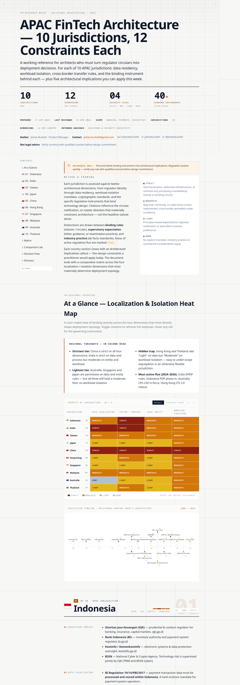

# APAC Regulations

[](LICENSE)
[](https://github.com/jamesbuckett/regulatory-apac-regulations/stargazers)
[](https://github.com/jamesbuckett/regulatory-apac-regulations/commits)
[](https://github.com/jamesbuckett/regulatory-apac-regulations/issues)

> FinTech architecture constraints across 10 APAC markets — data, cloud, cyber, AI/model risk.

## About

Documents the technology architecture constraints imposed by financial-services regulators across 10 APAC jurisdictions. Covers 12 dimensions per market — data localization, system localization, legal-entity segregation, cross-border flow, cloud, cyber resilience, AI/model risk, and more — with binding-instrument citations and dated claims. Targets solutions architects, security architects, and technology-risk leads sizing up regional constraints during workload placement and platform design. Ships as a single self-contained `index.html` with no framework, no build step, and no runtime dependencies.

## Usage

The brief is a single self-contained HTML file. Open it directly:

```bash
xdg-open index.html        # Linux
open index.html            # macOS
```

Or visit the live deployment: <https://regulatory-apac-regulations.vercel.app/>



## Project Structure

```
.
├── index.html        # Self-contained brief — open to read the document
├── preview.png       # Hero screenshot
├── VERIFICATION.md   # Third-party correctness check
├── screenshot.mjs    # Local Playwright helper (gitignored)
├── screenshots/      # Generated PNGs (gitignored)
├── LICENSE           # MIT
└── README.md
```

## Contributing

Issues and pull requests welcome. Please open an issue first to discuss substantial changes.

## License

[MIT](LICENSE) © 2026 James Buckett
